# Week 1 - 기정

> 주제: 자료구조 / 알고리즘 기초

---

## 빠른 정리 노트

- **중위 순회**: 왼쪽 노드 → 중간 노드 → 오른쪽 노드 순으로 순회
- **균형 트리**를 만들면 검색의 시간복잡도를 최적화할 수 있다
- **AVL 트리**: 만든 사람 이름에서 따온 이름 (Adelson-Velsky and Landis)
- **레드-블랙 트리**: 레드가 연속으로 나올 수 없다 / 삼촌 빼고 나머지 셋을 정렬 / 새로운 노드의 부모와 삼촌 색깔을 바꾼 다음 조상 노드를 빨간색으로 / 해결될 때까지 반복 / 조상 노드가 root면 검정색으로 / 삽입 삭제 시 유리
- **B-트리**: B-/B+ 가 있지만 일반적으로 B-트리를 B트리라고 부름

---

## 6. BST와 균형 트리

## 6.1. BST (이진 탐색 트리, Binary Search Tree)

- BST는 다음 조건을 만족하는 트리이다.
  1. 노드의 왼쪽 하위 트리에는 노드의 key보다 **작은** key를 가진 노드만 포함된다.
  2. 노드의 오른쪽 하위 트리에는 노드의 key보다 **큰** key를 가진 노드만 포함된다.
  3. 모든 자식 트리가 이진 탐색 트리이다.
  4. 중복된 key를 허용하지 않는다.

- **BST 생성 과정**
  - 첫 번째 요소를 루트로 삽입
  - 이후 요소를 루트부터 비교하며, 작으면 왼쪽 / 크면 오른쪽으로 삽입 (반복)

- **BST 특징**
  - **중위 순회(inorder traversal)** 를 수행하면 **정렬된** 결과를 얻을 수 있다.

- **BST 검색 시간복잡도**
  - 균형 상태: $O(\log n)$
  - 불균형 상태: $O(n)$

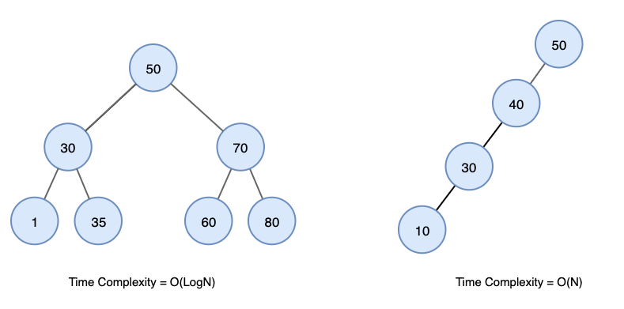

---

## 6.2. 균형 트리

- 모든 **서브트리의 높이 차이**가 최대 1인 이진트리
- 검색의 시간복잡도를 최적화할 수 있다
- 불균형 상태를 피하기 위해, 노드 삽입/삭제 시 트리를 재조정한다

### 6.2.1. AVL 트리

- 균형 이진 탐색 트리
- 삽입/삭제 후 균형 유지를 위해 **회전 연산**을 한다.

**AVL 트리의 회전 연산**

1. **단일 왼쪽 회전**: 오른쪽 서브트리에 노드가 추가되어 불균형이 발생한 경우

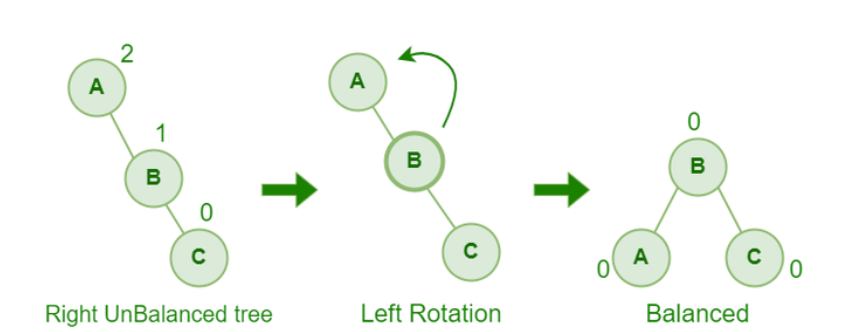

2. **단일 오른쪽 회전**: 왼쪽 서브트리에 노드가 추가되어 불균형이 발생한 경우

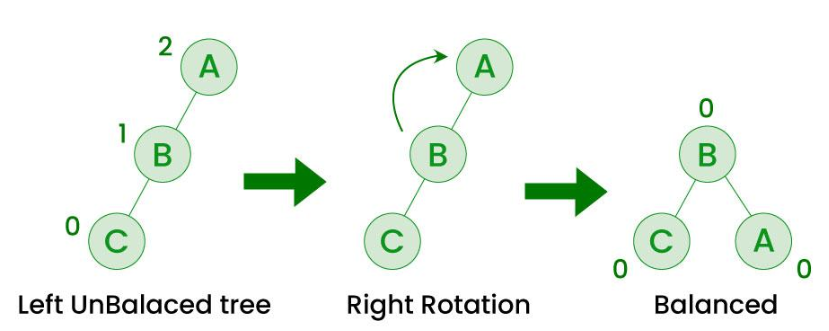

3. **이중 회전 (왼쪽-오른쪽 회전)**: 왼쪽 자식 노드의 오른쪽 서브트리에서 불균형 발생 시, ① 서브트리에서 왼쪽 회전 → ② 오른쪽 회전

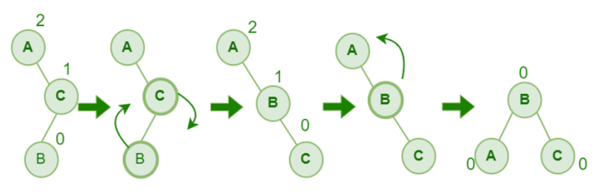

4. **이중 회전 (오른쪽-왼쪽 회전)**: 오른쪽 자식 노드의 왼쪽 서브트리에서 불균형 발생 시, ① 서브트리에서 오른쪽 회전 → ② 왼쪽 회전

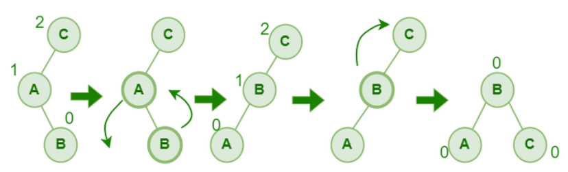

- **AVL 트리 삽입/삭제/탐색 시간복잡도**: $O(\log n)$
- **AVL vs 레드-블랙 트리**: AVL은 엄격한 balance → **탐색에 유리**

---

### 6.2.2. 레드-블랙 트리

- 균형 이진 탐색 트리
- 각 노드가 **레드** 또는 **블랙** 색을 갖는다.
- 삽입/삭제 후 균형 유지를 위해 **회전 연산**과 **색깔 변경**을 한다. (무조건 회전하지 않고 색깔만 바꿔도 되는 경우가 있다)

**색깔 규칙**
1. 각 노드는 레드 또는 블랙이다.
2. 루트 노드는 블랙이다.
3. 리프 노드(nil)는 블랙이다.
4. 레드 노드의 자식 노드는 검은색이다 (**No Double Red**)
5. 모든 리프 노드에서 **Black Depth**가 같다 (루트까지 경로에서 만나는 검은색 노드 개수가 같다)

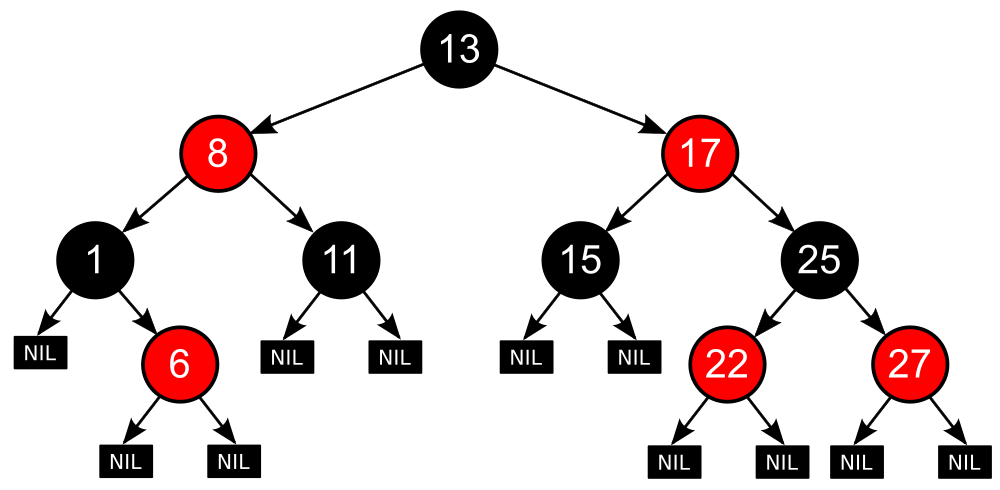

**삽입 과정**

1. 새로운 노드를 **빨간색**으로 삽입
2. Double Red가 발생하면 해결

**a. Restructing** — 삼촌 노드가 **검정색**인 경우

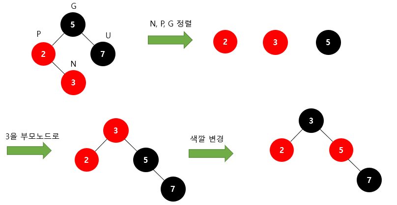

1. 새로운 노드, 부모 노드, 조상 노드를 오름차순 정렬
2. 중간값을 부모 노드로, 나머지 둘을 자식 노드로
3. 부모 노드 → 검은색 / 자식 노드 → 빨간색

**b. Recoloring** — 삼촌 노드가 **빨간색**인 경우

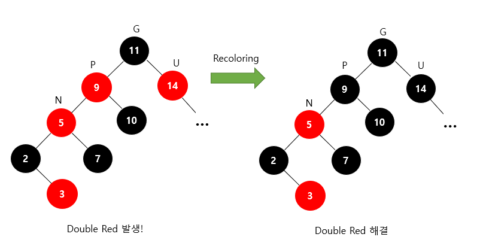

1. 새로운 노드의 부모와 삼촌을 검은색으로, 조상 노드를 빨간색으로 변경
2. 조상 노드가 루트라면 검은색으로 변경
3. 조상을 빨간색으로 바꿔 Double Red가 다시 발생하면 Restructing 또는 Recoloring 반복

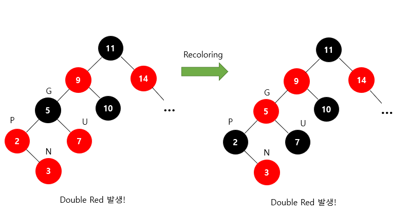

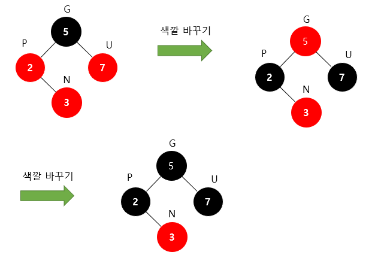

- **레드-블랙 트리 시간복잡도**: $T(n) = 2\log(n+1)$ → $O(\log n)$
- **레드-블랙 vs AVL 트리**: 느슨한 balance → **삽입/삭제에 유리**

---

### 6.2.3. B-트리

- 이진 트리가 아닌 균형 트리
- 가질 수 있는 자식 노드의 개수가 2개보다 크다

**B-트리의 특징**

1. **M차 B트리**의 내부 노드는 `⌈M/2⌉` ~ M 개의 자식을 가질 수 있다. (루트, 리프 노드 제외)
2. **M차 B트리**의 각 노드에는 M-1 ~ `⌈M/2⌉`-1 개의 Key를 가질 수 있다. (루트 노드 제외)
3. **M차 B트리**의 내부 노드의 Key가 $x$개라면, 자식의 수는 $x+1$개다.

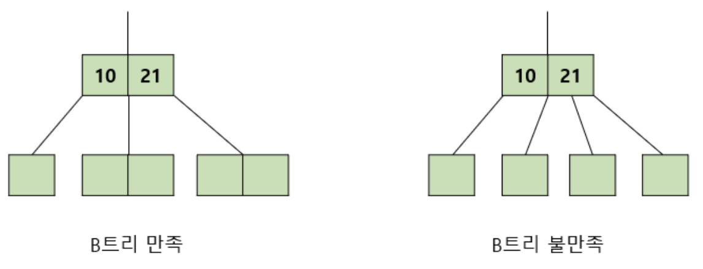

4. **M차 B트리**의 최소 차수가 $t$일 때, 최소 자식 수는 $t$, 최대 자식 수는 $2t$, 최대 Key의 개수는 $2t-1$이다.

**B-트리 탐색 과정**
- 루트 노드를 시작으로 **하향식**으로 찾는다.

**B-트리 삽입 과정**
1. Key를 삽입하기에 적절한 리프 노드를 찾는다.
2. 필요한 경우 노드를 분할한다. (상향식)

13을 삽입했을 때, 노드가 최대로 가질 수 있는 Key의 개수를 초과:


중앙값 12를 기준으로 분할하고, 12를 부모노드에 삽입:

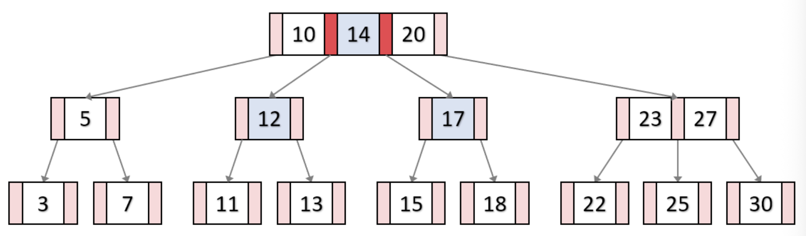

(반복) 중앙값 14를 기준으로 분할하고, 14를 부모노드에 삽입:


(반복) 중앙값 14를 기준으로 분할하고, 14가 새로운 루트노드가 된다:

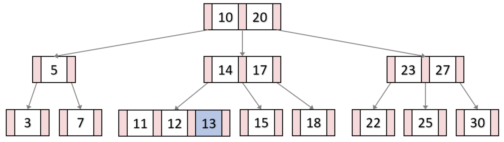

> B-트리 삭제 과정: TODO

---

## 7. 정렬과 탐색 기초

## 7.1. 정렬 (Sorting)

데이터를 **특정한 기준**에 따라 **순서대로 나열**하는 것 (오름차순 / 내림차순)

### 7.1.1. 버블 정렬 (Bubble Sort)

- **방식**: 인접한 두 원소를 비교하여, 순서가 잘못되면 교환. 한 번 순회마다 가장 큰 값이 뒤로 이동
- **특징**: 구현 단순, 실제 사용성 낮음
- **시간복잡도**: 최선 $O(n)$ (이미 정렬된 경우) / 평균·최악 $O(n^2)$

### 7.1.2. 선택 정렬 (Selection Sort)

- **방식**: 매 단계마다 가장 작은 값을 선택해서 앞쪽에 배치
- **특징**: 교환 횟수 적음, 비교 횟수 항상 많음
- **시간복잡도**: 최선·평균·최악 $O(n^2)$

### 7.1.3. 삽입 정렬 (Insertion Sort)

- **방식**: 정렬된 부분에 새 원소를 적절한 위치에 삽입
- **특징**: 데이터 개수 적을 때 / 거의 정렬된 데이터에 강함
- **시간복잡도**: 최선 $O(n)$ / 평균·최악 $O(n^2)$

### 7.1.4. 병합 정렬 (Merge Sort)

- **방식**: 데이터를 반으로 나누고, 각각 정렬한 뒤 병합. 분할정복(Divide and Conquer) 기반
- **특징**: **안정 정렬** (같은 값의 원소 순서가 정렬 전후에 동일) / 배열 상태와 무관하게 일정한 성능
- **시간복잡도**: 최선·평균·최악 $O(n \log n)$
- **공간복잡도**: $O(n)$ (추가 배열 필요)

### 7.1.5. 퀵 정렬 (Quick Sort)

- **방식**: pivot을 정하고, pivot보다 작은 값과 큰 값으로 나누는 과정 반복
- **특징**: 평균적으로 매우 빠름 / 추가 공간 적음 / pivot 선택이 중요
- **시간복잡도**: 최선·평균 $O(n \log n)$ / 최악 $O(n^2)$ (pivot이 계속 비효율적인 경우)

### 7.1.6. 힙 정렬 (Heap Sort)

- **방식**: Heap을 이용해 최대값 또는 최소값을 반복적으로 꺼내 정렬
- **특징**: 추가 메모리 적음 / 최악에도 $O(n \log n)$ 보장 / 구현 복잡
- **시간복잡도**: Heap 생성 $O(n)$ + 추출 반복 $O(n \log n)$ → 전체 $O(n \log n)$

### 7.1.7. Swift Array의 정렬

- `sort()` 시간복잡도: $O(n \log n)$
- 내부적으로 **TimSort** 사용 (MergeSort + InsertionSort 기반, 배열 크기에 따라 전환)

---

## 7.2. 탐색

### 7.2.1. 선형 탐색 (Linear Search)

- 앞에서부터 하나씩 비교하며 탐색
- 예시: `contains(_:)`, `first(where:)`, `firstIndex(of:)`
- **시간복잡도**: 최선 $O(1)$ / 평균·최악 $O(n)$
- **특징**: 구현 단순 / 정렬 여부와 무관하게 사용 가능

### 7.2.2. 이진 탐색 (Binary Search)

- **정렬된 데이터**에서 가운데 값을 기준으로 탐색 범위를 절반씩 줄여가며 탐색
- 예시: 사전에서 단어 찾기
- **특징**: 매우 빠름 / 정렬 비용이 별도로 필요할 수 있음
- **시간복잡도**: 최선 $O(1)$ / 평균·최악 $O(\log n)$

### 7.2.3. 정렬과 탐색의 관계

| 상황 | 추천 방법 |
|------|-----------|
| 정렬되지 않은 데이터 | 선형 탐색 $O(n)$ |
| 정렬된 데이터 | 이진 탐색 $O(\log n)$ |
| **한 번만** 찾을 데이터 | 정렬 없이 선형 탐색이 유리 |
| **여러 번** 반복 탐색 | 정렬 후 이진 탐색이 유리 |

> 정렬은 탐색 성능을 높이기 위한 **전처리** 역할을 하기도 한다.

---

## 8. 재귀와 반복

### 8.1. 재귀 (Recursion)

함수가 **자기 자신을 다시 호출하는 방식**. 반드시 두 요소가 필요하다:
- **기저 조건(base case)**: 재귀를 멈추는 조건
- **재귀 호출(recursive case)**: 문제를 더 작은 문제로 줄여서 다시 호출

```swift
func factorial(_ n: Int) -> Int {
    if n <= 1 { return 1 }
    return n * factorial(n - 1)
}
```

**장점**
- 코드가 간결해질 수 있다
- 트리, 그래프, 분할정복 문제 표현에 좋다
- 예시: 트리 순회, DFS, 병합 정렬, 퀵 정렬, 피보나치

**단점**
- 함수 호출 스택 사용 → 메모리 오버헤드
- 깊이가 너무 깊으면 **stack overflow** 발생 가능
- 반복문보다 느릴 수 있다
- 공간복잡도: $O(n)$ (호출 깊이에 비례)

### 8.2. 반복 (Iteration)

`for`, `while` 등을 사용해서 같은 작업을 여러 번 수행하는 방식

```swift
func sum(_ n: Int) -> Int {
    var result = 0
    for i in 1...n { result += i }
    return result
}
```

- 호출 스택 추가 사용 없음 → 메모리 효율 좋음
- 단순 반복 문제에서 더 직관적

### 8.3. 재귀 vs 반복 비교

```swift
// 재귀
func factorial(_ n: Int) -> Int {
    if n <= 1 { return 1 }
    return n * factorial(n - 1)
}

// 반복
func factorial(_ n: Int) -> Int {
    var result = 1
    for i in 1...n { result *= i }
    return result
}
```

| 상황 | 유리한 방식 |
|------|-------------|
| 트리 구조, 분할정복 | 재귀 |
| 문제 구조 표현이 중요할 때 | 재귀 |
| 단순 누적 계산 | 반복 |
| 성능·메모리 우선 | 반복 |
| 호출 깊이가 깊어질 수 있는 경우 | 반복 |

### 8.4. 재귀 호출의 시간복잡도

```swift
func fib(_ n: Int) -> Int {
    if n <= 1 { return n }
    return fib(n - 1) + fib(n - 2)
}
```

한 번 호출에 두 번의 재귀 호출 → 시간복잡도 약 $O(2^n)$

### 8.5. 재귀와 Stack의 관계

재귀 함수는 내부적으로 **호출 스택**을 사용한다.
→ DFS를 재귀로 구현할 수도 있고, 명시적인 Stack으로도 구현할 수 있다.

---

## 9. 캐시 지역성

시간복잡도가 같아도 실제 실행 시간은 다를 수 있다. 이때 중요한 개념이 **캐시 지역성(Cache Locality)** 이다.

CPU는 메인 메모리(RAM)보다 훨씬 빠르므로, 자주 쓰는 데이터나 가까운 데이터를 캐시에 저장해 두고 사용한다.

### 9.1. 시간적 지역성 (Temporal Locality)

한 번 접근한 데이터가 **가까운 미래에 다시 사용**될 가능성이 높은 성질

예시: 반복문에서 같은 변수 재사용 / 스택의 top 반복 접근

### 9.2. 공간적 지역성 (Spatial Locality)

한 번 접근한 데이터 **근처의 주소**를 곧이어 접근할 가능성이 높은 성질

예시: 배열을 앞에서부터 순차 탐색 / 연속된 메모리 접근

### 9.3. 배열이 실제로 빠른 이유

배열은 메모리 상에 **연속적으로 저장**되므로 공간적 지역성이 좋다.
→ 이론적 시간복잡도가 같아도 실제 실행에서 더 빠른 경우가 많다.

### 9.4. 연결 리스트가 실제로 불리한 이유

연결 리스트는 노드가 메모리 여기저기에 흩어질 수 있다.
→ 다음 노드로 이동할 때마다 **캐시 미스**가 발생할 가능성이 높다.
→ 이론적으로 삽입/삭제는 효율적이지만 실제 실행에서는 배열보다 느릴 수 있다.

### 9.5. 정리

| 개념 | 설명 |
|------|------|
| 시간적 지역성 | 최근 접근한 데이터를 다시 접근할 가능성 |
| 공간적 지역성 | 가까운 메모리 주소를 연속해서 접근할 가능성 |
| 배열 | 지역성 좋음 → 실제 성능 강점 크다 |
| 연결 리스트 | 지역성 나쁨 → 캐시 미스 가능성 높다 |

> 알고리즘 분석에서는 이론적 복잡도도 중요하지만, 실제 구현에서는 **메모리 배치와 캐시 효율**도 함께 고려해야 한다.

